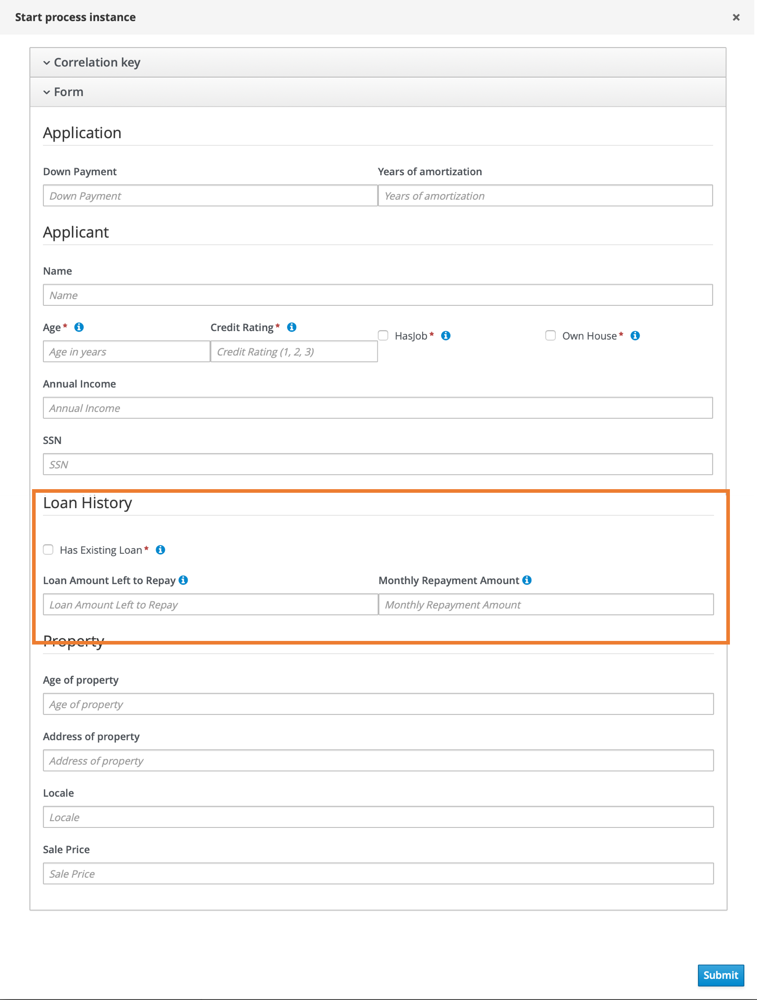


## SECTION 1 : PROJECT TITLE
## Enhance Mortgage Loan Approval Process

---
## SECTION 2 : EXECUTIVE SUMMARY / PAPER ABSTRACT
In the typical mortgage loan approval process, there are many factors that could affect the final approval decision. The decision maker attempts to assess the loan repayment ability of the person by considering factors such as income level and credit rating. However, given the vast number of considerations, the process tends to be tedious and requires a long period of time when evaluation is done manually by human.

Using the techniques taught in lectures, I learnt how to automate the tedious process mentioned earlier.
First, I enhanced the data provided for mortgage loan process to consider an additional factor of whether or not the individual has an existing loan.
The data was further mined using Orange3 and the following decision tree was obtained:

As seen in the above diagram, given that the individual does not own a house nor have a job, having an existing loan can have an impact on the approval of the mortgage loan.
A new data object named 'Loan History' was created, which includes the attribute hasExistingLoan. Subsequently, it is added as a subsection in Application form, as seen in the image below. 

The above subsection will obtain the information about applicant's existing loan and allow us to further refine existing decision table to incorporate the knowledge gained from the decision tree.

---
## SECTION 3 : CREDITS / PROJECT CONTRIBUTION

| Official Full Name  | Student ID (MTech Applicable)  | Email (Optional) |
| :------------ |:---------------:| :-----|
| Chen Liwei | A0101217B | E0384319@nus.edu.sg |

---

## SECTION 4 : USER GUIDE

1. Install KIE Workbench
2. Clone this project
3. Unzip example-Mortgage_Process.zip in SystemCode folder and import project into KIE workbench

---

## SECTION 5 : MISCELLANEOUS

### S-MR bank loan example v003.csv
* Enhanced csv with loan history data
* Insights derived, which were subsequently used to enhance mortgage loan system
