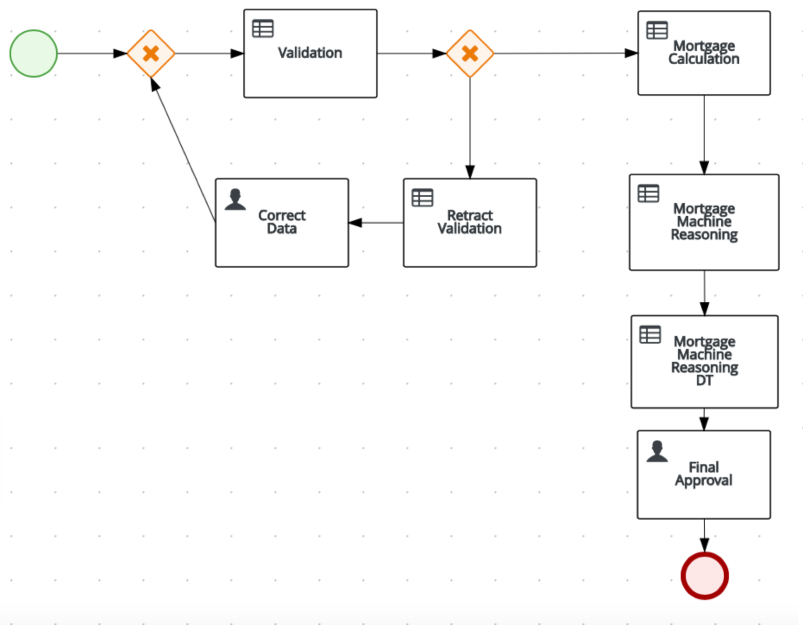
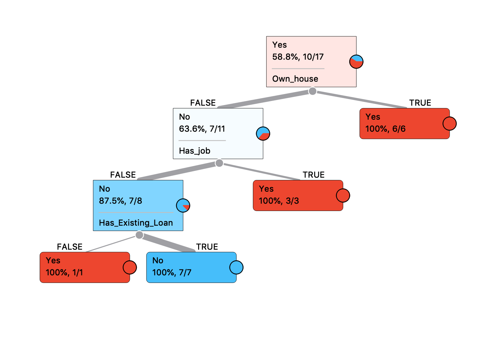
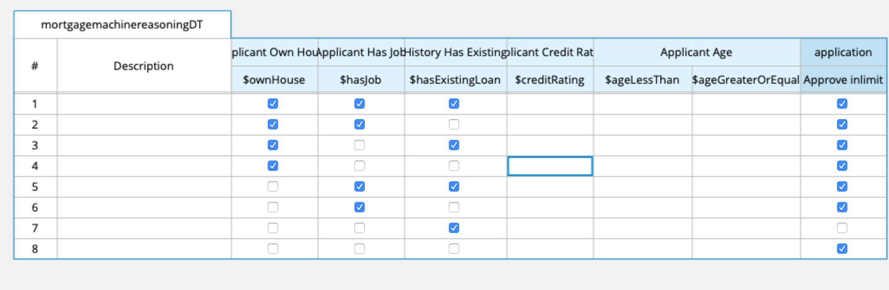


## SECTION 1 : PROJECT TITLE
## Enhance Mortgage Loan Approval Process

---
## SECTION 2 : EXECUTIVE SUMMARY / PAPER ABSTRACT
In the typical mortgage loan approval process, there are many factors that could affect the final approval decision. The decision maker attempts to assess the loan repayment ability of the person by considering factors such as income level and credit rating. However, given the vast number of considerations, the process tends to be tedious and requires a long period of time when evaluation is done manually by human.

Using the techniques taught in lectures, I learnt how to automate the tedious process mentioned earlier.
First, I enhanced the data provided for mortgage loan process to consider an additional factor of whether or not the individual has an existing loan.
The data was further mined using Orange3 and the following decision tree was obtained:

As seen in the above diagram, whether or not the individual has an existing loan can have an impact on whether the mortgage loan is approved if the individual does not own a house nor have a job.     
The decision table was further enhanced to incorporate the mentioned point.

---
## SECTION 3 : CREDITS / PROJECT CONTRIBUTION

| Official Full Name  | Student ID (MTech Applicable)  | Email (Optional) |
| :------------ |:---------------:| :-----|
| Chen Liwei | A0101217B | E0384319@nus.edu.sg |

---
## SECTION 4 : VIDEO OF SYSTEM MODELLING & USE CASE DEMO

Not Applicable

---
## SECTION 5 : USER GUIDE

1. Install KIE Workbench
2. Clone this project
3. Unzip example-Mortgage_Process.zip in SystemCode folder and import project into KIE workbench

---
## SECTION 6 : PROJECT REPORT / PAPER

`<Github File Link>` : <https://github.com/telescopeuser/Workshop-Project-Submission-Template/blob/master/ProjectReport/Project%20Report%20HDB-BTO.pdf>

**Recommended Sections for Project Report / Paper:**
- Executive Summary / Paper Abstract
- Sponsor Company Introduction (if applicable)
- Business Problem Background
- Project Objectives & Success Measurements
- Project Solution (To detail domain modelling & system design.)
- Project Implementation (To detail system development & testing approach.)
- Project Performance & Validation (To prove project objectives are met.)
- Project Conclusions: Findings & Recommendation
- List of Abbreviations (if applicable)
- References (if applicable)

---
## SECTION 7 : MISCELLANEOUS

### S-MR bank loan example v003.csv
* Enhanced csv with loan history data
* Insights derived, which were subsequently used to enhance mortgage loan system
